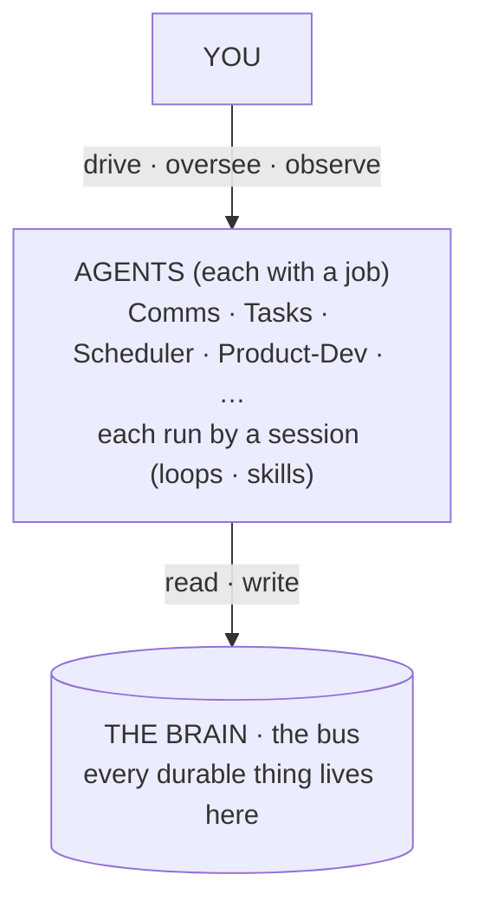
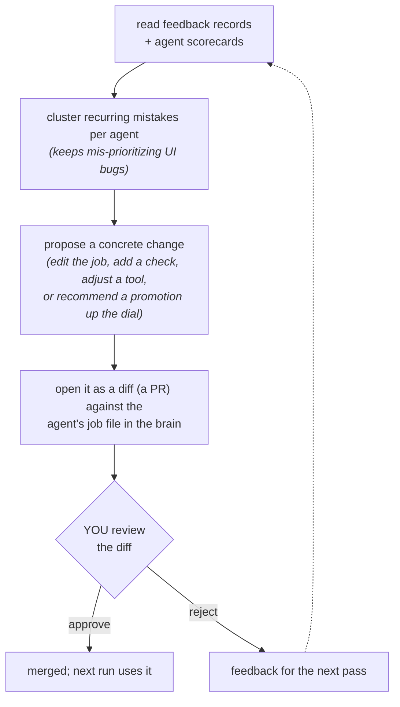

# An Architecture for Agentic Work

### A technology-agnostic vision for putting AI agents to work in well-defined **jobs** — from a single agent to a whole-business system

**Audience:** the operator who wants AI to do real work across their day, and any builder (in any stack) who will implement it.
**Companion document:** [`BRAIN_ARCHITECTURE.md`](./BRAIN_ARCHITECTURE.md) is the peer architecture for the **Context plane** (the brain) referenced throughout. This document describes the *system around the brain* — how work is organized, run, observed, governed, and improved.

---

## 0. What this is, and what it is not

This is a **vision and a set of invariants** — the rules that don't bend — not an implementation. It names the parts, says what each is responsible for, and fixes the rules that hold them together — and deliberately says nothing about which language, model, database, or services you use.

That is the point. Two people should be able to read this and build systems that work the same way but share no code — one wiring it together from scripts on a laptop, another from off-the-shelf cloud services. Both are *correct* if they honor the rules in §3. **The architecture is the contract; the technology is a fill-in-the-blank** — §13 shows two example setups side by side.

A second kind of restraint runs through this document: **it is opinionated about *mechanism* and agnostic about *policy*** (developed in §1.3). The architecture fixes what capabilities must exist and how they are wired; it leaves the settings to you.

**Read it as a compass, not a checklist.** Start with one agent. Add capability only when the work demands it.

---

## 1. The three core ideas

Everything in this document descends from three ideas. Hold these and the rest is elaboration.

### 1.1 The brain is the bus. The runner is swappable.

All durable state — context, work to do, what was done, how well it went, how to improve — lives in **one place: the brain** (plain files under version control, per `BRAIN_ARCHITECTURE.md`). Agents never call each other. They coordinate *only* by reading and writing the brain.

This single rule keeps the system simple at one agent and still simple at fifty:

- **The runner is stateless, so it's swappable.** An agent's work is executed by a **session** (one run) on a **provider** (Anthropic, OpenAI, an open-source model). Kill the session, restart it, rewrite it in another language, or swap the provider — nothing is lost, because the runner held nothing. The agent's job and memory were in the brain all along.
- **Coordination needs no special machinery.** No extra plumbing wiring the agents together. "Agent A tells Agent B something" is just "Agent A writes a file, and Agent B reads it."
- **The whole system is inspectable.** Its entire state is human-readable files under version control. You can understand it at any time by reading it.

### 1.2 Agents hold jobs

How we organize agentic work has advanced with one underlying driver: **the task horizon an agent can sustain on its own.** Each model generation reliably handles a longer, more complex task than the last — and every jump unlocks a new way of organizing the work:

| As agents sustain longer tasks… | A representative task | We organize the work as… |
|---|---|---|
| **seconds** — a single answer | answer a question | a **prompt** |
| **a session** — a dialogue | draft, brainstorm, look something up | a **chatbot / assistant** |
| **minutes to hours** — a task loop | write & test a component; debug a flaky test suite | an **agent on a task** |
| **days, then continuous** | clear the backlog nightly; run a pipeline end to end | an **agent holding a job** |

The left column is the engine. A one-off **agent on a task** finishes and is done; an **agent holding a job** carries *ongoing responsibility across many tasks*. That second thing becomes possible only once the horizon stretches from *finishing a task* to *holding a job* — the threshold we're crossing now. Most systems still organize around the one-off task; organizing instead around durable, accountable **agents that hold standing jobs** is what captures the new capability.

An **agent** is a worker with a **job**: a standing contract of **responsibility + authority** — "Communications Manager," "Scheduler," "Product Development Lead" — bundled with the tools and knowledge to do it. The job is durable and well-defined, written down as a file in the brain. This is deliberately how we already think about work — humanity spent centuries building the job/org-chart idea to make large-scale work understandable, and adopting it hands the architecture a vocabulary you already have intuitions for (see §2): hiring an agent, reviewing its performance, coaching it, promoting it, reorganizing.

**Humanizing the agent doesn't make it precious.** Picture an agent as a worker — it holds a job, a bounded context, its own tools and knowledge — but the **session** that executes it keeps **no state of its own**: the agent's memory lives in the brain, its job in a knowledge file. That is §1.1's swappability seen from the org side: a job and a company's records outlast whoever does the work today. The brain and the agent's job persist; the session is how the work gets done right now.

### 1.3 Opinionated about mechanism, agnostic about policy

The architecture is firm about *how things are wired* (the mechanism) and deliberately silent about *the settings you choose* (the policy). The two settings that matter most are **how much autonomy** each agent gets (§8) and **how you stay in the loop** (§9). For both, it hands you the controls and a clear way to reason about them — and never decides for you.

---

## 2. Agents: the operator's view of the system

The architecture has **two complementary views**:

- **The builder's view — planes (§4).** How capability is decomposed for implementation: context, work, activation, telemetry, learning, interface.
- **The operator's view — agents.** How the running system is understood and managed: an org of accountable agents, each with a job.

Agents are what make the system *relatable*. Everything technical contextualizes into something you already know how to think about:

| Architecture concept | Agent / org vocabulary |
|---|---|
| an agent's domain | its area of responsibility |
| autonomy level | its authority / seniority |
| schedules, loops, skills, prompts | *how it does the job* — its internals |
| the run-ledger (§6) | activity reporting |
| evaluation (§10) | performance review |
| the improvement loop (§11) | coaching, training, promotion |
| human intervention (§9) | a manager stepping in |
| adding an agent | hiring |
| splitting/merging agents | reorg |

One guardrail keeps this abstraction honest: **an agent is a job, not a personality.** Keep it *structural*, defined by what it's accountable for and what it may do (§1.2), not a name and a character. Picturing the agent as a worker is useful, but don't let a friendly name ("Sam from Comms") buy trust the agent hasn't earned: trust comes from its track record (§10), not its persona. The other two properties carry over unchanged from §1: the agent's job and memory (in the brain) are durable while the session and provider running it are the swappable part (normally one session per agent, though a complex agent may spin up helper sub-agents within its own run), and agents coordinate only brain-as-bus.

**Taxonomy is not fixed.** Start with one agent. Split an agent when its job is trying to be good at two different things at once. Merge two when they never act without each other. The org serves the work.

---

## 3. The invariants (the constitution)

An implementation is compliant if and only if it honors these. Everything else is free.

1. **Everything lives in the brain.** All durable state lives there. If it isn't in the brain, it doesn't survive a restart and doesn't exist to the rest of the system.
2. **The brain is the bus.** No direct agent-to-agent calls. Agents coordinate exclusively through the brain. Coupling stays at zero.
3. **The runner is swappable.** The session that executes an agent, and the provider behind it, may be replaced at any time with no loss of state and no coordination required — because the runner holds none. The agent's job and memory live in the brain.
4. **Every capability rolls up to an agent.** No orphan automation. Every schedule, loop, and skill is owned by a named, accountable agent, so responsibility is always clear.
5. **Every run is recorded.** No agent does work without writing a run record (who, when, why, what it touched, tokens, cost, outcome). Observability is not optional and not bolted on later.
6. **Every action declares its consequence.** Each action an agent can take is tagged by reversibility/impact. This tag is the raw material of autonomy (§8) — mechanism, not policy.
7. **Intervention is always possible, and always captured as feedback.** The human can always step in; whenever they do, that event is recorded as a labeled example (§11). *That* intervention exists and is captured is mechanism; *which surface* it happens through is policy (§9).
8. **Opinionated about mechanism, agnostic about policy.** The architecture fixes capabilities and wiring; the operator chooses settings — autonomy levels and interaction surfaces above all.
9. **Degrade gracefully.** With the queue, telemetry, and tooling all deleted, the brain must still be a useful pile of markdown a human can read. Tooling is a convenience over the substrate, never a dependency of it.
10. **Simplicity is the tiebreaker.** When two designs both work, choose the one you can still explain in six months. Complexity must pay rent in present value, not anticipated need.

---

## 4. The architecture at a glance (the builder's view)

Six **planes**, each a thin layer over the same brain. You adopt them in order; each is independently useful. Agents live in the Work plane; the management lens (§2) reinterprets the rest.



The spine is just three layers: **you** drive/oversee/observe, **agents — each with a job** — do the work, and **the brain** is the only thing they share. The six planes below are how a *builder* decomposes that spine — the diagram is the *operator's* view.

| Plane | Responsibility | Stored as | Adopt when |
|---|---|---|---|
| **Context** | Single source of truth | brain files (`BRAIN_ARCHITECTURE.md`) | Day one |
| **Work** | Agents (each with a job) that own outcomes | jobs (`knowledge/agents/`) + harness (`harness/`) + a work queue (`runtime/`) | Day one (one agent) |
| **Activation** | What wakes agents — loops, events, dreaming | schedule/trigger config in `harness/` | When you want hands-off running |
| **Telemetry** | A record of every run: tokens, cost, actions, outcome | append-only run-ledger | As soon as you have >1 loop |
| **Learning** | Review agents; turn feedback into improvement | eval-results + feedback files | Once an agent does steady work |
| **Interface** | How you drive, oversee, and observe | surfaces you choose (§9) | As soon as agents act on their own |

---

## 5. Anatomy of an agent

An **agent** is a worker with a job — the unit of work and of accountability. It is defined entirely by files in the brain, so it stays inspectable and improvable.

**An agent is defined by:**

| Part | What it is | Why it lives in the brain |
|---|---|---|
| **Job** | Its responsibilities, scope, and **authority level** (§8), written as a plain knowledge file — like a job description; stored in the brain's knowledge area (`knowledge/agents/<name>/`) | So improvement and promotion are just edits to this file (§11) |
| **Harness** | How it runs: its system prompt, loops, skills, and model binding (its *machinery*), stored in the brain's `harness/<name>/` area (`BRAIN_ARCHITECTURE.md §5`) | So capability is explicit and owned, never orphaned (invariant #4) |
| **Tools** | The actions the agent may take, each tagged by consequence (#6) | So autonomy is governed by data, not buried in code |
| **Schedule** | When the agent wakes (§7) | So activation is inspectable config |
| **Reporting** | Its run records, scorecard, and digest contributions | So the agent is observable and reviewable like an employee |

Memory is conspicuously absent: an agent keeps **no state of its own** outside the brain — it borrows the brain. That is what keeps the runner swappable.

**A session is one stateless run of the agent.** Because it keeps no state of its own, each **run** is a clean instance that:
1. **Wakes** on a trigger (a schedule, an event, or you).
2. **Reads** the brain to load only the context the task needs.
3. **Does bounded work** using the agent's tools, against the agent's job.
4. **Writes back** results to the brain through its write contract (`BRAIN_ARCHITECTURE.md §6`), not by editing raw files — and always a **run record** (#5).
5. **Stops**, holding no state.

Ending and resuming a run, or handing it to a new provider, therefore loses nothing (#1, #3).

That contract is satisfied equally by a Claude Code session, a Codex script, a cron'd Python process, or a hosted function — the **provider is a fill-in-the-blank** (§13). **Why split work across agents rather than pile it on one do-everything agent:** smaller context, sharper jobs, independent schedules, independent review, and independent failure. A bug in the Communications agent never touches Product Development. You add a specialist — a new agent — only when the work earns it.

---

## 6. Activation: loops and dreaming

An agent does work without you because something **wakes** it (starts a session). Three trigger types, in increasing sophistication — most systems only ever need the first.

1. **Heartbeat loops (the default).** An agent wakes on a schedule and asks, "what's new in my area, and what should I do about it?" — read new email, triage new bug reports, reconcile the calendar. Cadence matches the job: comms hourly, product-dev a few times a day, billing weekly. A loop is just *trigger → read brain → bounded work → write back → stop*.

2. **Event triggers (optional).** A webhook or watcher wakes an agent on a specific event (a deploy finished, a high-priority ticket opened) instead of waiting for the next tick. Use only where latency genuinely matters; otherwise a slightly faster heartbeat is simpler and has fewer moving parts.

3. **Dreaming (the nightly consolidation).** When the day is quiet, dreaming does the reflective work the loops never get to. It splits in two by *nature of the work*:

   - **Cross-cutting consolidation** — read everything new in the brain, organize and file it, reconcile contradictions across agents, surface cross-agent patterns, prune and link, and prepare tomorrow's digest. This work belongs to *every* agent and to *none* in particular — an agent reflecting in its own silo structurally can't see across the others — so it is owned by a dedicated **System agent**: the nightly ingestion/triage job in `BRAIN_ARCHITECTURE.md §7`, generalized. That keeps invariant #4 absolute: dreaming, too, rolls up to an agent.
   - **Per-agent reflection** — reviewing an agent's own runs, clustering its own feedback, and proposing diffs to its own job (the improvement pass, §11). This is sharper with the agent's own context loaded — but it is an *earned* split, not a starting cost: begin with the System agent doing it for everyone, and hand an agent its own reflection only once the global pass is too coarse to review it well (the same earned-complexity rule as everywhere else, #10).

> **Loops react. Dreaming reflects.** A system with only loops is busy but never gets smarter. Dreaming turns a day of activity into organized knowledge and a better system tomorrow.

---

## 7. Telemetry: knowing where the work and the tokens go

Invariant #5 says every run writes a record. The **run-ledger** is the append-only collection of those records — *just more files in the brain* (runtime-area files, not OKF knowledge; see `BRAIN_ARCHITECTURE.md §5`), so you get observability without a separate monitoring stack. The format below is illustrative — the runtime area is not bound to any. In org terms, this is each agent's **activity report.**

**Every run record carries, at minimum:**

```yaml
agent:        communications-manager
session:      comms-triage
run_id:       2026-06-14T09:00:03Z-comms
trigger:      heartbeat            # heartbeat | event | manual
started:      2026-06-14T09:00:03Z
duration_s:   42
tokens_in:    18204
tokens_out:   3110
cost_usd:     0.21
actions:      [read_inbox, drafted_reply:3, filed_to_brain:2]
escalated:    1
outcome:      ok                   # ok | partial | failed | needs_human
notes:        "1 reply escalated: contract question from Acme"
```

From this one stream you get:

- **Where tokens and money go**, rolled up by agent and by day — the biggest spenders become obvious.
- **A high-level activity view** of what every agent did, without reading transcripts.
- **Debuggability** — a bad outcome links straight to the run that caused it.
- **The denominator for evaluation** — you can't measure work-done-per-dollar without recording the dollar.

Two rules keep it honest: the record is written by the harness around the session, not by the model's own say-so (so it can't be flattered); and it is append-only (runs are history, never edited). One practical corollary: **tokens and cost must be read from the runtime's own usage report** — most providers expose this in a structured/JSON output mode — never estimated. A run record without a real cost is a broken record; *work-done-per-dollar* (§10) has no denominator without it.

---

## 8. Autonomy: a dial, not a default

This is where "agnostic about policy" matters most. **How much autonomy an agent has is a choice — your taste, your risk appetite, the maturity of the work — not something the architecture decides.** Reframed through the org, the question becomes one every manager already knows how to answer: **what authority does this agent have?**

### The dial

The architecture treats autonomy as a continuous dial and presents **every position as legitimate:**

| Setting | The agent… | Like a… |
|---|---|---|
| **Advisory** | only proposes; you execute everything | intern drafting for your signature |
| **Supervised** | acts on reversible work; gates consequential actions | new hire whose big moves you check |
| **Delegated** | acts; escalates only genuine judgment calls | trusted employee with periodic 1:1s |
| **Autonomous** | acts within policy; you review outcomes, not actions | senior leader you set objectives for |

### The mechanism (fixed) vs. the policy (yours)

**Mechanism the architecture guarantees:**
- every action carries a **consequence tag** (#6);
- every agent carries an **authority level** in its job;
- the rule that runs everywhere: **an action proceeds when the agent's authority covers its consequence; otherwise it escalates** (§9);
- **reversibility and audit** (the run-ledger, the brain's version history) so that acting-then-reviewing is safe;
- **graduated trust**: authority can rise as an agent's evals prove it out (§10–11) — promotion with evidence, not by vibe.

**Policy you set, per agent, and revise over time:** where each agent sits on the dial; which of its actions count as consequential; how high the escalation bar is.

### A deliberate design bias

The architecture refuses to *mandate* high autonomy — but it is **built to make raising autonomy cheap and safe.** This encodes a belief without imposing it:

> The value ceiling of an agentic system scales with how much work it can do *without* a human in the critical path. A system held at low autonomy is capped at human throughput — it can never do the massive volume of work that is the entire reason to build it. So the architecture is designed so that the natural gradient is *upward*: as an agent earns trust, moving it up the dial should be a small, reversible, well-instrumented change.

You are free to keep any agent at Advisory forever. The architecture simply ensures that when you *want* to delegate more, nothing structural is in your way.

---

## 9. The human surfaces: drive, oversee, observe

The other place policy dominates. A common mistake — and the one baked into "just use an approval queue" — is to assume a single surface for all human↔system interaction. There are really **three distinct surfaces**, and they need not be the same thing:

| Surface | What you're doing | Example mechanisms |
|---|---|---|
| **Drive** | initiating work; setting objectives and guardrails | a chat front-desk, creating a task, editing an agent's job |
| **Oversee** | steering, correcting, or approving *ongoing* autonomous work | approval queue, exception escalations, real-time interrupts, guardrail rules |
| **Observe** | seeing what already happened | the daily digest, the run-ledger, a dashboard |

### The surface follows the autonomy level

The **Oversee** surface is not a fixed choice — the right one *follows the dial* in §8, exactly as a manager's style follows an employee's seniority:

| Autonomy setting | How you'd oversee a person | The matching surface |
|---|---|---|
| Supervised | check the work before it goes out | **approval queue** (per-action gate) |
| Delegated | they act; escalate judgment calls; weekly 1:1 | **exception escalation + digest review** |
| Autonomous | set objectives and guardrails; review outcomes | **policy/guardrails + post-hoc review & rollback** |

This is the resolution to the approval-queue question. An approval queue is a **legitimate but low-autonomy** surface: it puts the human back in the critical path of every action, which caps throughput at human speed — self-defeating at exactly the autonomy level where the system's value is highest. As you move an agent up the dial, you stop approving individual actions and start **setting policy up front and reviewing outcomes** — you manage a senior leader, you don't proofread their email.

### Engagement varies in time, not just by surface

The surfaces above are *what* you do; engagement also varies in *when* and *how continuously* — a spectrum from synchronous to fully asynchronous:

- **Conversational** — stay in the loop, steering and interrupting a running agent in real time (natural at Supervised/Delegated).
- **Outcome-oriented** — hand over a goal and let the agent iterate until the result is satisfactory, judging the outcome, not the steps (Delegated/Autonomous). The loop only terminates because "satisfactory" is *defined* — and those acceptance checks are the same ones evaluation uses (§10).
- **Start and resume later** — kick a task off and pick it up days afterward.

The last is the clearest payoff of brain-as-bus: you never resume a *session* — no state lives in one — so a fresh session reloads the agent's durable state from the brain and continues, making a days-long gap free (#1, #3). It is the human-side mirror of the lengthening task horizon (§1.2): as work runs for days, your involvement spans days too.

One distinction this exposes: an **inbound** queue of *your* instructions waiting for an agent is not the **outbound** approval queue of the agent's actions waiting for *you* (§8). Same word, opposite directions.

### What stays invariant

Whatever surfaces you choose (#7, #8): **intervention must always be possible, and every intervention is captured as feedback.** That two-part guarantee is mechanism. Everything about *which* surfaces, *how many*, and *how they look* is policy — pick what fits you, and let it differ per agent and evolve as agents mature.

---

## 10. Evaluation: the performance review

You can't improve what you don't measure, and "the agent seems fine" is not measurement. **Evaluation benchmarks how well an agent does *real work*** — its periodic performance review.

- **Outcomes, not vibes.** Define, per agent, what a good result *is*: comms = the right messages got the right replies and nothing important dropped; product-dev = bugs triaged at the correct priority, plans sound. Write these as a small, growing set of checks.
- **Real cases as the test set.** The best benchmark is past real work with a known-good outcome — often the outcome *after* you intervened (§11). Replay it; see if the agent now gets it right.
- **A scorecard per agent**, written back to the brain: pass rate on its checks, **work-done-per-dollar** (from telemetry, §7), **intervention rate** (how often you had to step in), and trend over time.
- **An LLM-as-judge for the fuzzy parts**, calibrated against your interventions as ground truth.

The **intervention rate** is the headline metric: a maturing agent needs you less over time. If it doesn't, evaluation tells you *which* agent and *on what kind of task* — precisely the input improvement needs, and the evidence that justifies a promotion up the autonomy dial (§8).

---

## 11. Improvement: coaching, and promotion

Improvement is a **loop, and it is automated** — but it lands its changes through a gate you control. Its fuel is what the system has been quietly collecting all along:

1. **Your interventions** (#7). Every correction, override, answered escalation, or contributed fact was captured as a **feedback record** — a labeled example of "what the agent should have done."
2. **Eval results** (§10) — which agents fall short, and on what.

**The improvement pass (a natural job for the dreaming agent, §6):**



Why this gets better on its own *without* getting opaque:

- **Improvement = a readable diff to a job.** Because an agent's behavior is defined by files (§5), "the system improved itself" is a tracked, reversible change you can read, question, and revert. No hidden weights, no mystery. This is **coaching** made auditable.
- **Promotion is just one kind of improvement.** When evals prove an agent out, the proposed diff may *raise its authority* (§8) — the system recommending its own promotion, with the scorecard as the case for it. You approve the raise; the agent takes on more without a human in the critical path.
- **Your scarce attention compounds.** A correction made once becomes a labeled example that prevents the whole class of mistake — instead of the same correction every week.
- **The loop closes.** Intervene → captured → clustered → proposed as a fix or promotion → you approve the diff → evals confirm the gain → intervention rate drops. The system's job is to need you less, and to *prove* it earned the trust.

Keep the human as the gate on **self-modification** for as long as it's cheap to — it's the one place where full autonomy is genuinely dangerous, and a diff review is genuinely cheap.

---

## 12. The maturity path: start small, grow without re-architecting

The architecture is the same at every size. You grow by **hiring agents and adding planes** — never by reorganizing the foundation. Each stage is a place you can *stop* and have a coherent, useful system.

| Stage | What exists | What you get |
|---|---|---|
| **0 — Brain** | Just the brain (`BRAIN_ARCHITECTURE.md`), no agents | A durable, queryable context store you and a chat agent use by hand |
| **1 — One agent** | Brain + one agent on a heartbeat loop + run records | Hands-off work in your highest-value area; telemetry from day one |
| **2 — A few agents** | Several agents, all coordinating via the brain | A small org of specialists; your chosen surfaces (§9) become the control room |
| **3 — Dreaming** | A **System agent** running nightly consolidation/improvement | The system organizes itself and starts getting smarter, not just busier |
| **4 — Self-improving** | Evals + feedback + the improvement loop running | Measured agents that need you less over time, provably — and earn promotions |
| **5 — Business system** | Many agents spanning operations, mostly autonomous | A system that helps operate the business, still readable as plain files |

Because nothing above stage 0 changes the substrate or the invariants, **stage 5 is stage 1 with more of the same** — more agents on the same bus, more files of the same kinds. That is the whole reason for brain-as-bus and agents-as-encapsulation: **scaling is hiring, never migration.**

The direction is yours. One person scales toward a personal chief-of-staff; another scales a single Product-Dev agent into a full delivery org; another spreads across every domain of a business. Same architecture, different emphasis.

---

## 13. Filling in the blanks: the same architecture, two stacks

Every box above is a contract with an open implementation. Two compliant builds, sharing no code:

| Component | Person A (local/DIY) | Person B (cloud/SaaS) |
|---|---|---|
| Provider (model + execution environment) | Claude / Claude Code | OpenAI / Codex / a custom SDK |
| Language | Python | Node.js / TypeScript |
| Brain substrate | Markdown + git (OKF) + SQLite FTS index | Markdown + git (OKF) + Postgres index |
| Work queue | Files in a `queue/` dir | A hosted queue service |
| Activation | `cron` on a Mac mini | A managed scheduler + webhooks |
| Telemetry store | Append-only files in the brain | Same files, mirrored to a dashboard |
| Eval / judge | Local model calls | Hosted eval tooling |
| Drive/oversee/observe surfaces | A digest file + a queue file | A chat app + a web console |

Both honor §3. Both can read this document and recognize their own system. **If a future technology slots into one of these cells without touching the invariants, the architecture already accommodates it** — that is the test of a good fill-in-the-blank.

---

## 14. Anti-patterns: how this stays simple

The architecture's worst enemy is well-meant complexity. Most traps are already settled: the invariants (§3) rule out state outside the brain (#1), agents that call agents (#2), and skipping the run record (#5); §9 rules out forcing drive/oversee/observe through one surface; §11 keeps self-modification behind your review. The ones worth calling out on their own:

- **A central orchestrator that "coordinates" agents.** It becomes the bottleneck, the single point of failure, and the thing you can no longer understand. The brain coordinates; agents are peers. (A thin *planner* that only writes a "today's priorities" file is fine — it commands no one, and is naturally a System-agent capability alongside dreaming, §6.)
- **Letting a persona buy unearned trust.** Picturing an agent as a worker aids reasoning; letting a name or personality stand in for a track record does not. Keep agents structural — defined by accountability and authority — and judge an agent by its evals (§10), not its persona.
- **Treating autonomy as a global switch.** It's a per-agent dial set by policy and earned by evidence (§8), not one setting for the whole system.
- **A heavier retrieval stack before retrieval has demonstrably failed.** Per `BRAIN_ARCHITECTURE.md §8`, vectors/graphs are an upgrade you earn by hitting a wall, not a foundation you start with.
- **More agents or planes than the work needs.** Every agent is a job to maintain and a review to run. Hire one when the work earns it; not before.

> **The test, always:** can you still explain the whole system, out loud, in a few minutes, by pointing at files and naming agents? If not, something needs deleting — not documenting.

---

## 15. Glossary

Core terms (agent, job, harness, brain, autonomy dial) are defined where they first appear; this lists only the jargon a reader might jump to.

- **Plane** — a builder's-view layer of capability over the brain (context, work, activation, telemetry, learning, interface); the operator's-view counterpart is the agent (§2).
- **Mechanism vs. policy** — what the architecture fixes (capabilities, wiring) vs. what the operator chooses (autonomy, surfaces). See §1.3.
- **Session / provider** — the swappable runner. A **session** is one stateless run of an agent; the **provider** is the model and execution environment behind it (Claude Code, Codex, a custom SDK). Both replaceable with no loss of state (#3).
- **Consequence tag** — reversible vs. consequential label on an action; the raw material of autonomy (§8).
- **Dreaming** — the nightly job that consolidates and improves rather than reacts (§6); owned by the System agent, split into cross-cutting consolidation (always global) and per-agent reflection (an earned split).
- **System agent** — the dedicated agent that owns the cross-cutting work belonging to every agent and to none in particular: dreaming, ingestion, and the thin planner. Keeps invariant #4 absolute.
- **Intervention rate** — how often you must step in; the headline metric of an agent's maturity (§10) and the case for its promotion.

---

*Prime directive, restated: simplicity, maintainability, scalability — in that order. The brain serves the work; each agent does its job; the agents serve you; and the whole thing must stay readable as plain files you can understand at any time. The architecture fixes the mechanism and leaves the policy to you. When in doubt, remove something.*
