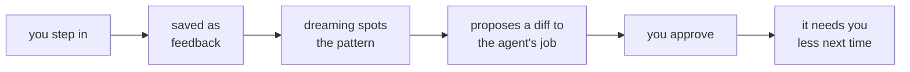

# Agent OS — the 2-minute version

A way to put AI to work across your day — and scale it from one agent to a system that helps run a business — **without it becoming something you can't understand.**

> The full docs: [`AGENT_ARCHITECTURE.md`](./AGENT_ARCHITECTURE.md) (the system) and [`BRAIN_ARCHITECTURE.md`](./BRAIN_ARCHITECTURE.md) (the foundation it runs on). This is the digest.

---

## Three ideas hold the whole thing up

1. **The brain is the bus.** All durable state lives in one place — plain files under version control. Agents never call each other; they coordinate by reading and writing the brain. So the runner is swappable: kill a run, swap the provider — nothing is lost, because the agent's job and memory were in the brain all along.
2. **Agents hold jobs.** Organize work the way a company does — each agent has an accountable **job** (like "Communications Manager"), not piled onto one do-everything bot. The job is durable and holds the tools and knowledge; the agent that does it persists, while the session and provider running it are swappable.
3. **Opinionated about mechanism, agnostic about policy.** The architecture fixes how things are wired; **you** choose the settings — above all, how much autonomy each agent gets.

---

## The shape

In one line: **you** drive, oversee, and observe; **agents**, each with a job, do the work; **the brain** is the only thing they share. (The full doc draws this as a stack, `AGENT_ARCHITECTURE.md §4`.)

---

## How it runs

Most of the work happens on its own, in two rhythms — and you can jump in any time.

```
  Loops      all day   wake → read brain → do a task → write back → log it
  Dreaming   nightly   organize · write the digest · propose improvements
```

- **Loops react** — an agent wakes on a schedule and handles what's new in its area.
- **Dreaming reflects** — one agent runs at night to tidy the brain and make the system smarter, not just busier.
- **You, on demand** — any time, just ask: query the brain, hand an agent a task, or steer one mid-run. (That's "driving," from the shape above.)

And it **improves itself, auditably:**



Every improvement is a readable diff you can revert. Nothing changes behind your back.

---

## Autonomy is a dial — set per agent

```
  Advisory     proposes only — you do everything
  Supervised   acts on small things; gates the big moves
  Delegated    acts; escalates only the judgment calls
  Autonomous   acts within policy; you review outcomes

  more oversight  ◄──────────────────────►  more throughput
```

You set it by taste and trust, and turn it up as an agent earns it (its evals are its performance review). Low autonomy is safe but slow; the payoff comes from delegating more as confidence grows.

---

## Start small, grow without rebuilding

```
  Brain → 1 agent → a few agents → + dreaming → + self-improving → business system
```

Each step (Stages 0 → 5 in the full doc) is a place you can stop and have something useful. Bigger is just **more of the same** — more agents on the same brain. Scaling is hiring, not migrating.

---

*The one test that keeps it simple: can you explain the whole system out loud in a few minutes, by pointing at files and naming agents? If not, something needs deleting — not documenting.*
